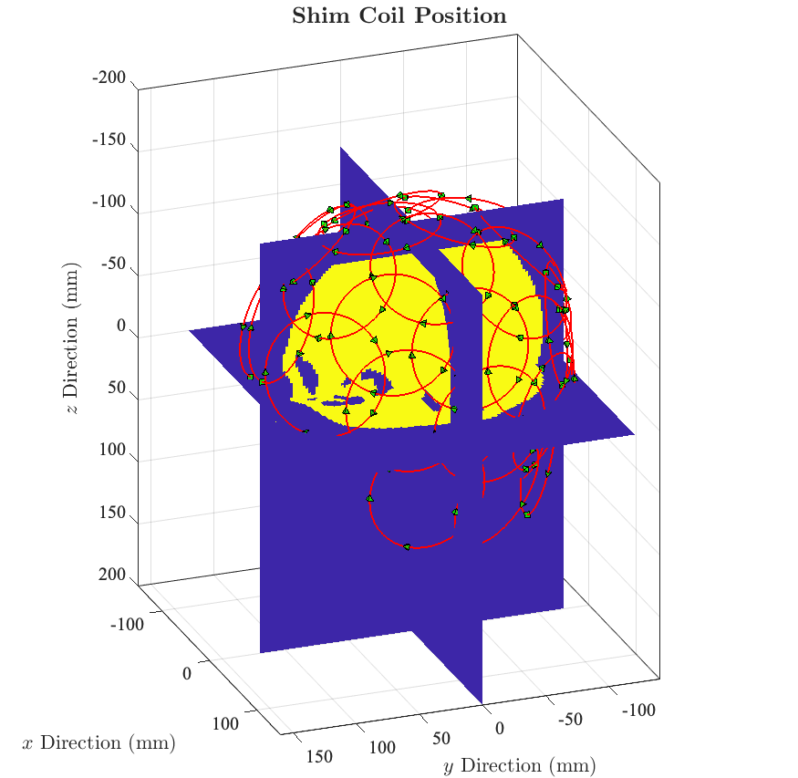
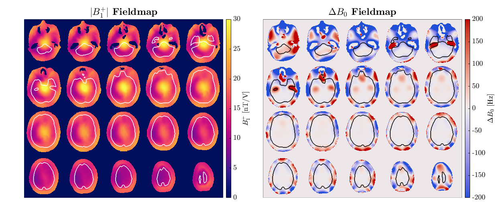
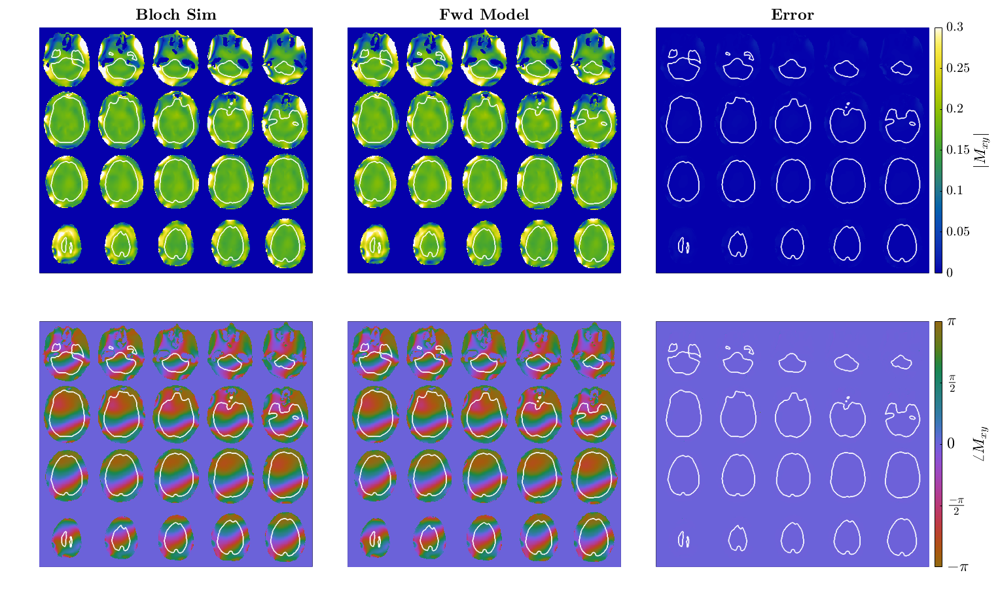
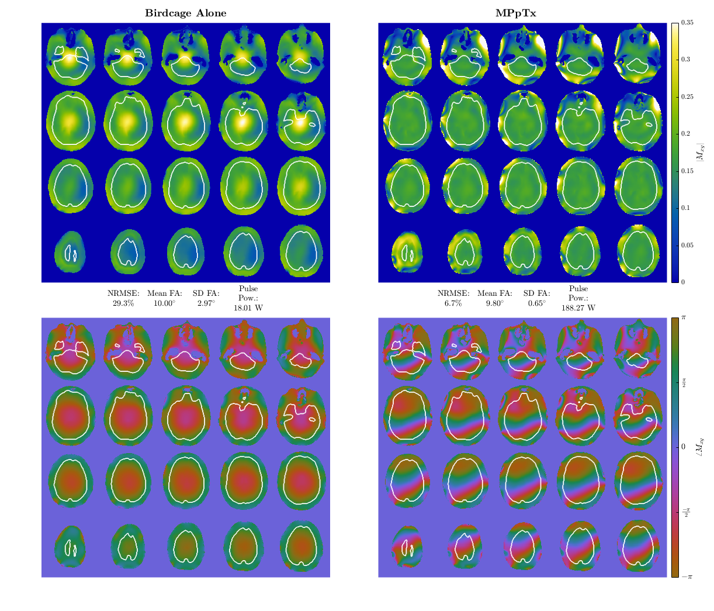
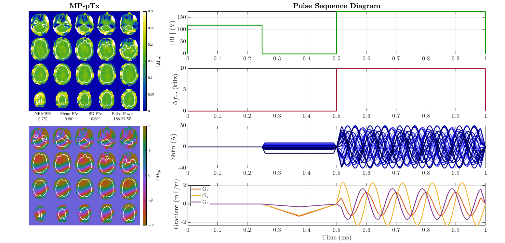

## Introduction

This code base contains example code from the manuscript, "**Multiphoton Parallel Transmission (MP-pTx): Pulse Design Methods and Numerical Validation**", which was recently submitted to *Magnetic Resonance in Medicine*. The example code demonstrates the optimization process for an MP-pTx pulse in the small-tip angle regime (STA). This originated from work performed at the Massachusetts General Hospital A. A. Martinos Center in the Department of Radiology. The code is written in the MATLAB® programming language, specifically version 2022b.

## Data Structure

This repository contains the implementation of the MP-pTx STA method (located in the `func` folder) along with an example script, `example_MPpTx_STA_optimization.m`, which demonstrates how to run a small-tip angle MP-pTx optimization.

The directory layout is as follows:

```text
MP-pTx-STA/
├── func/                                % source code directory
│   ├── ...                              % method implementation
├── example_MPpTx_STA_optimization.m     % example script
├── LICENSE
└── README.md

data/
├── 32ch_fields.mat
├── birdcage_fields.mat
├── db0_fields.mat
└── rng_state.mat              
```

Please clone the repository into a directory that also contains a `data` folder at the **same level** as the `MP-pTx-STA` directory. The example script assumes this relative structure.

We have provided simulated fieldmaps that can be used directly with the example script. These files can be downloaded [here](https://www.dropbox.com/scl/fo/9kvi9s21uq57isgxc4ong/AGcDuq1vLbTxNL9U_-bd4DE?rlkey=dyilcw9y98m1drx86m82d8a4i&st=jx9r5nbh&dl=0). Once downloaded, place them in the `data` folder alongside `MP-pTx-STA`.

## Code Usage

To run an example optimization and generate corresponding plots, simply run the `example_MPpTx_STA_optimization.m` script. This script specifies different optimization options which can be altered by the user if desired. To run the default script, which implements a "deterministic" genetic algorithm optimization (by specifying the random number generator), simply press ``Run``. It is suggested to run the default script on a workstation that can handle intensive computation and has RAM $\geq$ 8 GB.

## Model Specification

We optimize in the device coordinate system (DCS), as defined by the SIEMENS IDEA Guide, whereby if a subject is in the bore head-first supine, then the $x$-axis is right-to-left, the $y$-axis is posterior-to-anterior, and the $z$-axis is superior-to-inferior.

## Example Images

Shim coil:


Fields:

Forward Model Validation:

Birdcage Comparison:

Pulse Sequence Diagram:



Thank you for visiting this GitHub repository!
