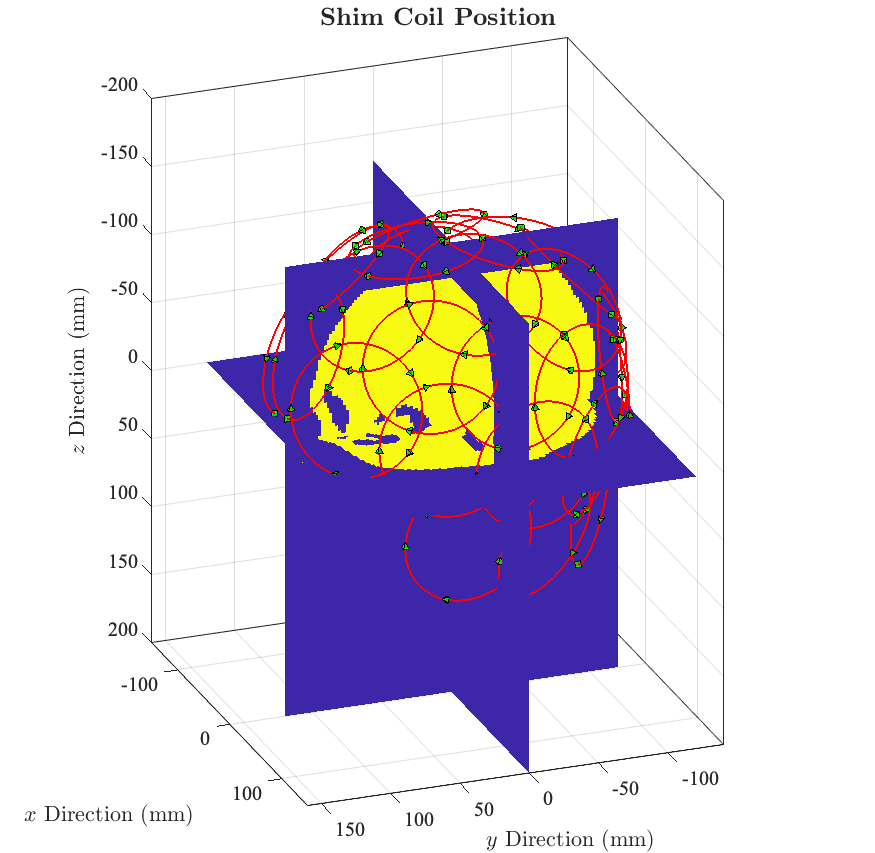
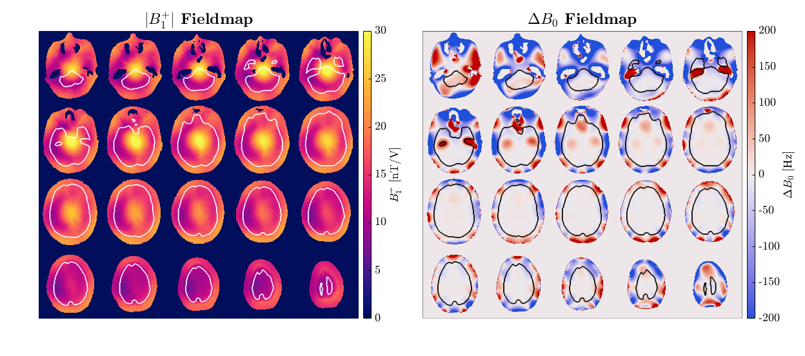
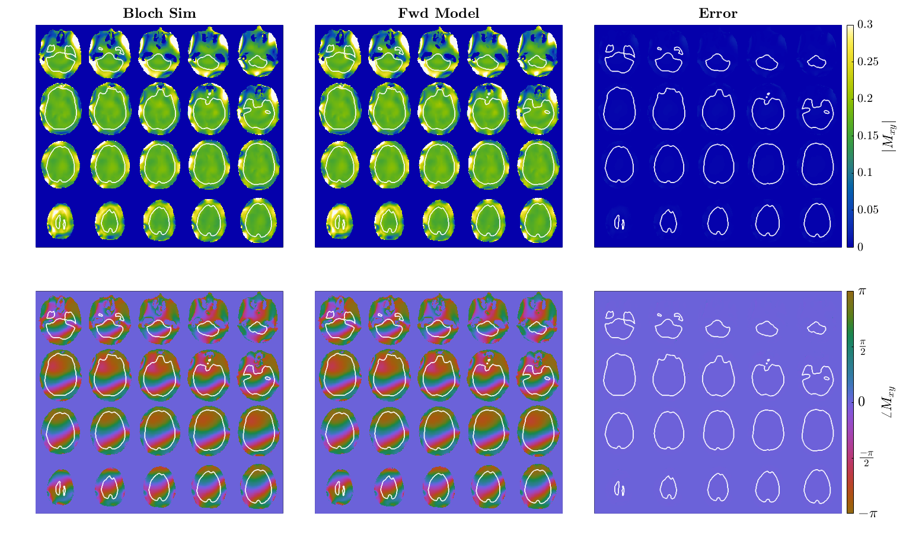
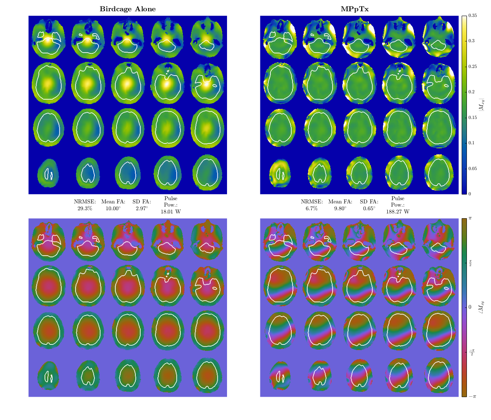
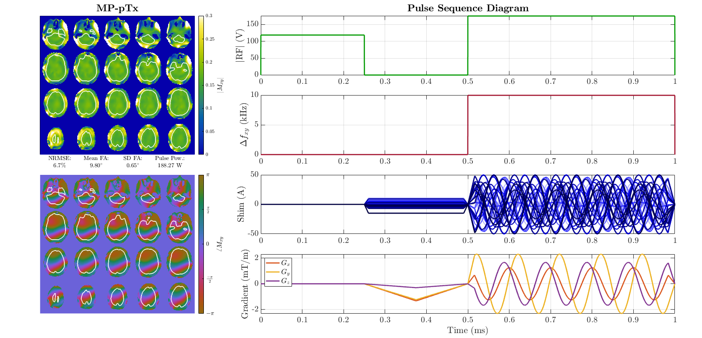

## Introduction

This code base contains example code from the manuscript, "**Multiphoton Parallel Transmission (MP-pTx): Pulse Design Methods and Numerical Validation**", which was recently submitted to *Magnetic Resonance in Medicine*. The example code demonstrates the optimization process for an MP-pTx pulse in the small-tip angle regime (STA). This originated from work performed at the Massachusetts General Hospital A. A. Martinos Center in the Department of Radiology. The code is written in the MATLAB® programming language, specifically version 2022b.

## Code Usage

To run an example optimization and generate corresponding plots, simply run the `example_MPpTx_STA_optimization.m` script. This script specifies different optimization options which can be altered by the user if desired. To run the default script, which implements a "deterministic" genetic algorithm optimization (by specifying the random number generator), simply press ``Run``. It is suggested to run the default script on a workstation that can handle intensive computation and has RAM $\geq$ 8 GB.

## Model Specification

We optimize in the device coordinate system (DCS), as defined by the SIEMENS IDEA Guide, whereby if a subject is in the bore head-first supine, then the $x$-axis is right-to-left, the $y$-axis is posterior-to-anterior, and the $z$-axis is superior-to-inferior.

## Example Images

Shim coil:

Fields:

Forward Model Validation:

Birdcage Comparison:

Pulse Sequence Diagram:

Thank you for visiting this GitHub repository!
